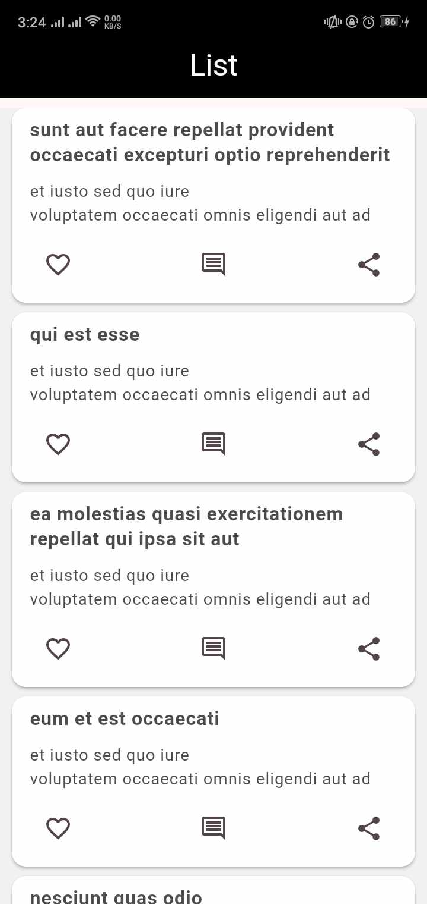
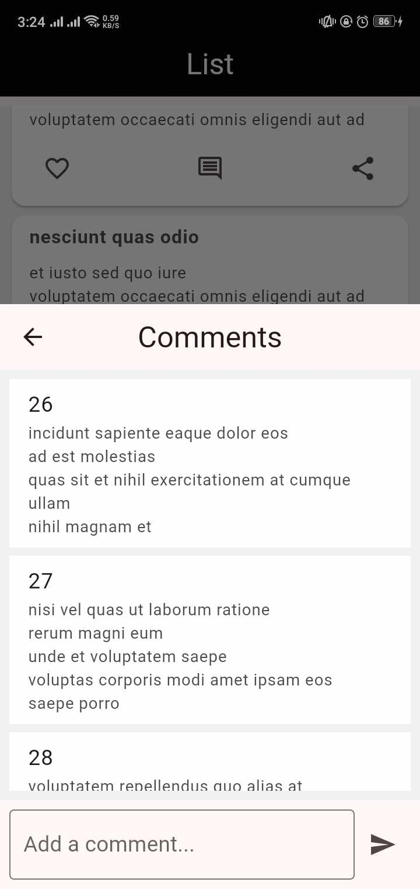
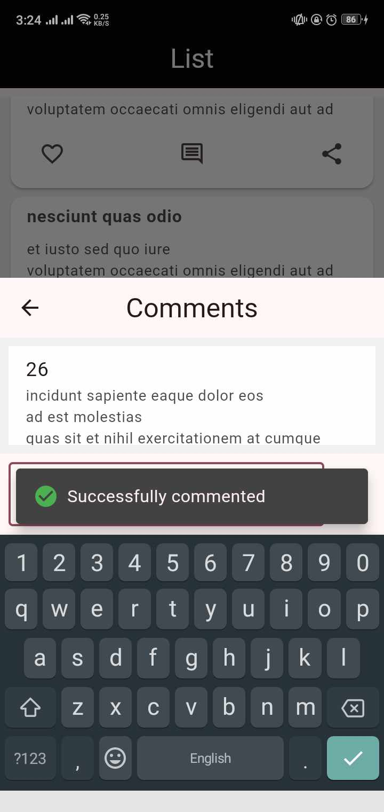

# techapp

## Getting Started

This is a Flutter project.

Once you pull or clone the code, run `flutter pub get`.

## Used Libraries

- Bloc, flutter_bloc, Equatable: for State Management.
- shared_preferences: for caching.
- dio: for handling network requests.

## Images of the app

## Description

The app navigates to the List screen where all the posts are listed. When the user presses the comment button, the comments from different users for the post will be shown. Users can also add comments to the post. Additionally, the loaded data is cached on the device for persistent storage and convenience for future use.
